# HP-Notebook Kurzanleitung

## Erstes Einschalten und Vergabe eines Kennwortes

Das HP-Notebook verfügt über zwei Benutzerkonten. Du arbeitest mit dem Konto `Standard`. Das andere Konto ist nur für die Schulverwaltung vorgesehen.

Nach dem Einschalten muss das Konto `Standard` gewählt werden.
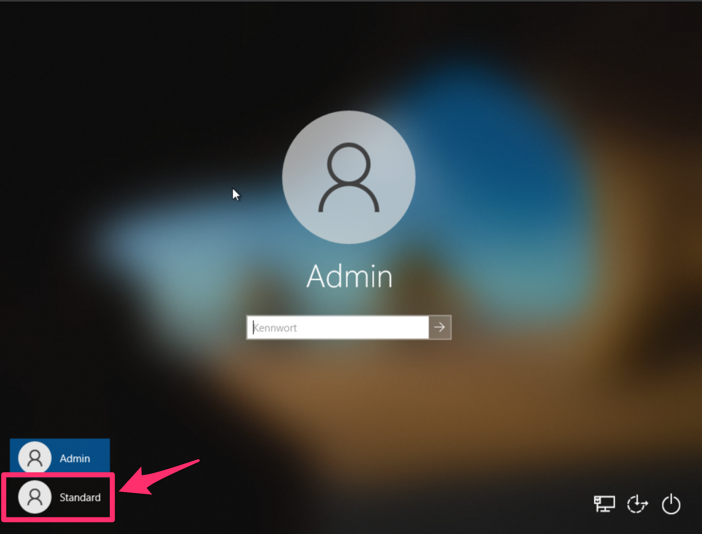

Beim ersten Einloggen muss noch das Kennwort geändert werden.
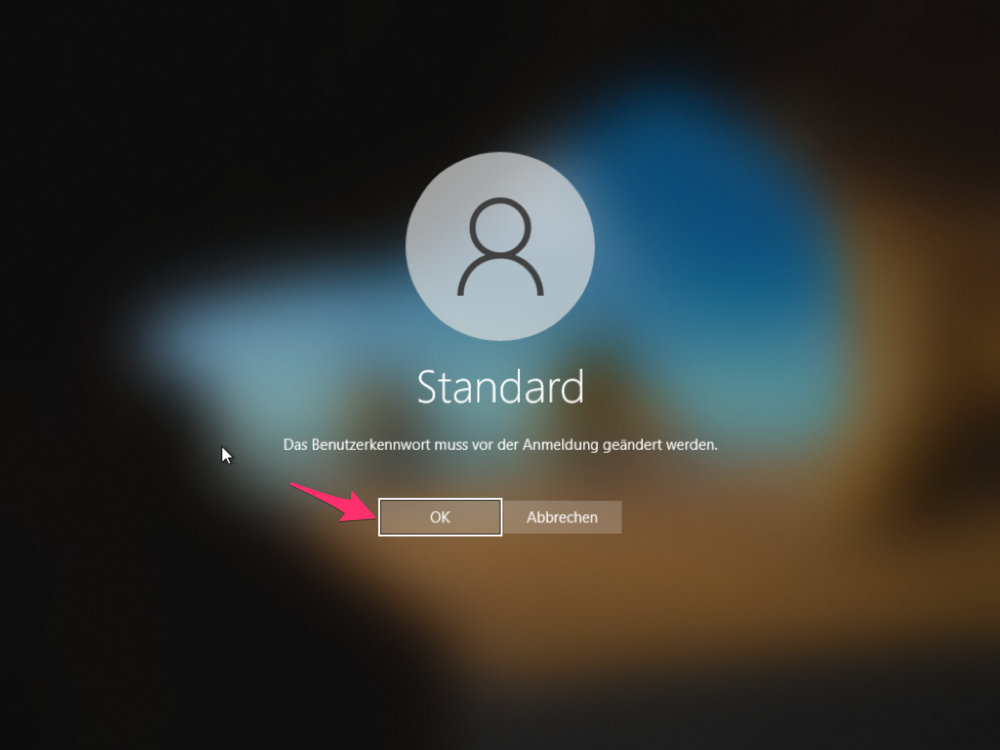

Das neue Kennwort zweimal eingeben.
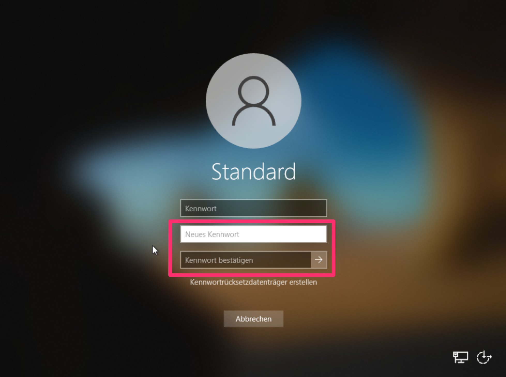

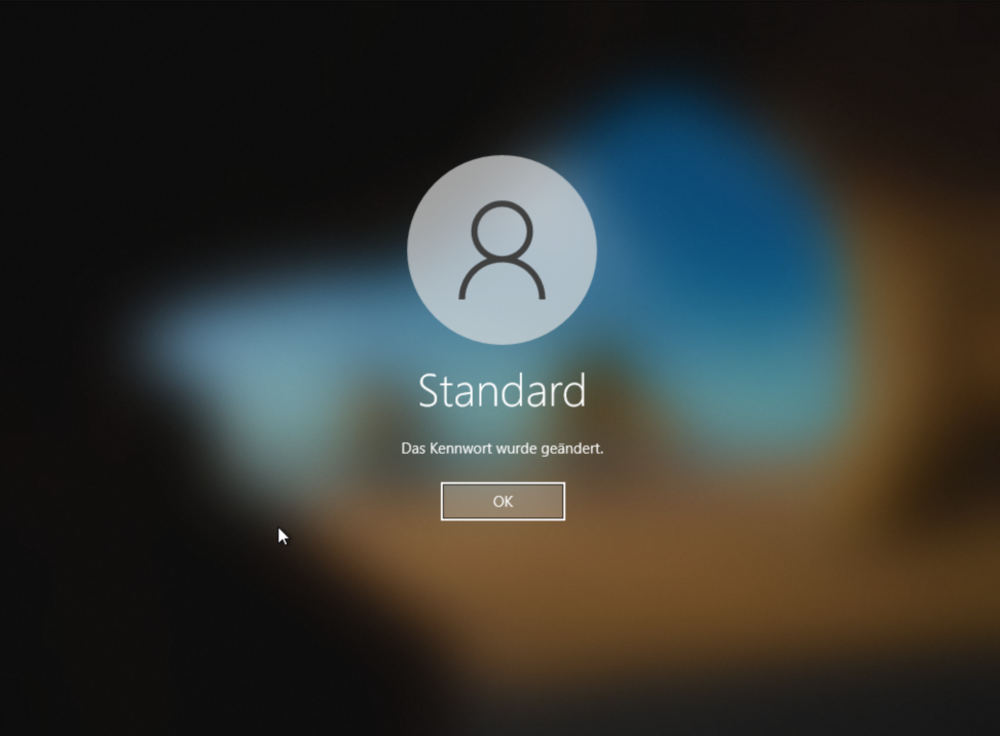

Beim ersten Login wird noch das Konto eingerichtet. Nach einiger Zeit erscheint dann der Desktop.
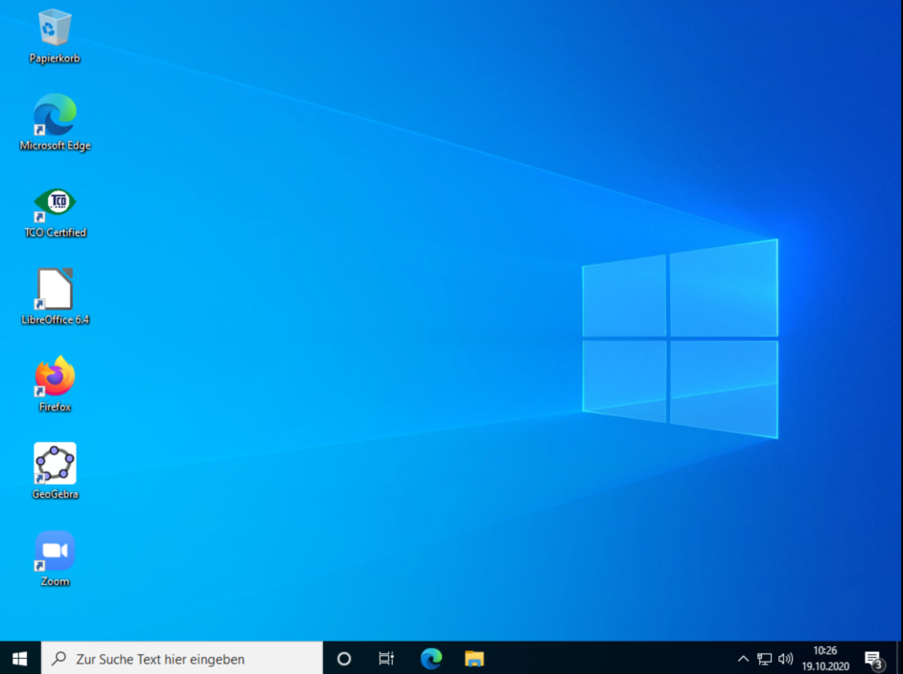

## Handbuch zum HP-Notebook

Auf dem Rechner ist das Benutzerhandbuch zum HP-Notebook installiert.

Im Windows Startmenü findest Du den Eintrag `HP Documentation`.

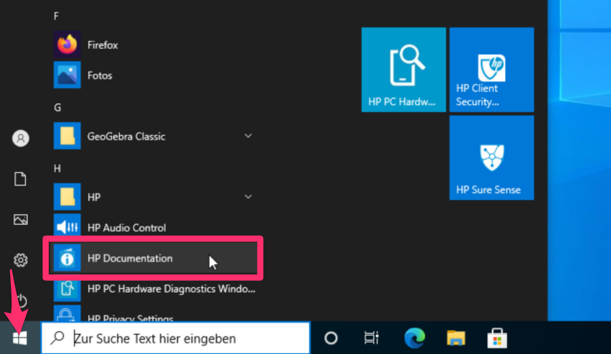

Die folgende Seite bietet eine Auswahl der Sprache. Das deutschsprachige Handbuch findest Du in der dritten Spalte unter `HP Dokumentation - Deutsch`.

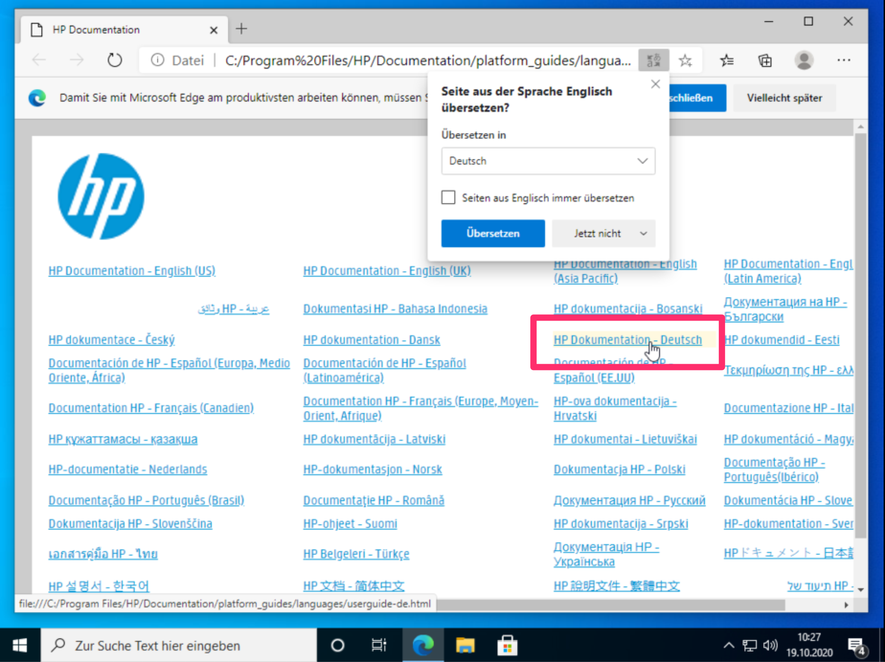

Auf der folgenden Seite findest Du dann das Benutzerhandbuch und weitere Informationen zum HP-Notebook.
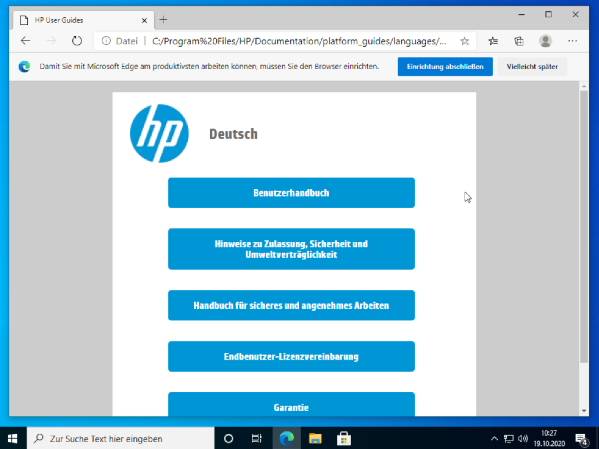

## Mit dem Netzwerk verbinden

### Kabelgebundenes Netzwerk

Auf der rechten Seite findest Du den LAN-Anschluss, falls Du das HP-Notebook mit einem Patchkabel mit dem Netzwerk verbinden willst. Normalerweise ist nichts weiter zu tun als das Kabel anzustecken.

### WLAN-Netzwerk

In der unteren Taskleiste kann über das Globus-Symbol eine Verbindung zu einem WLAN aufgebaut werden. Die verfügbaren WLAN-Netze im Umkreis werden angezeigt.

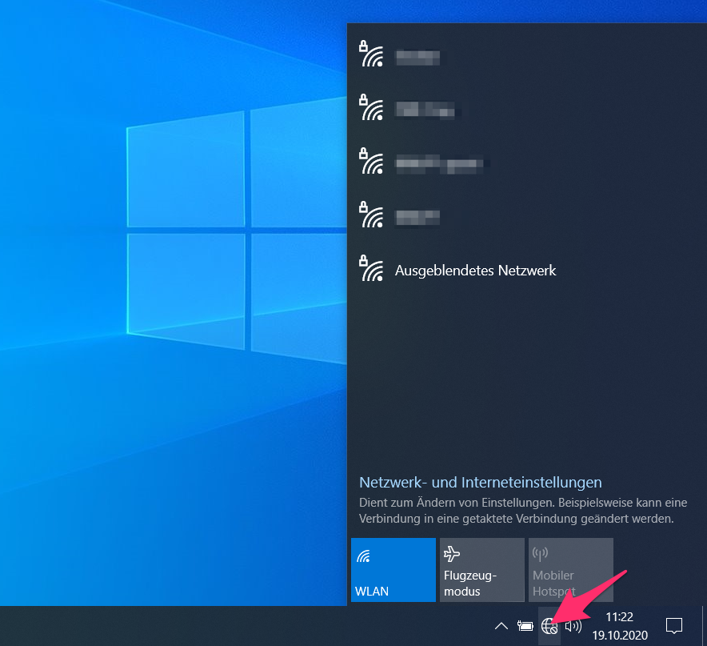

Das gewünschte WLAN auswählen und auf `Verbinden` klicken.
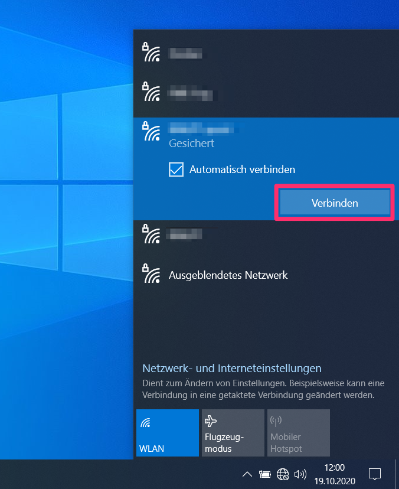

Das Kennwort des WLAN eingeben.
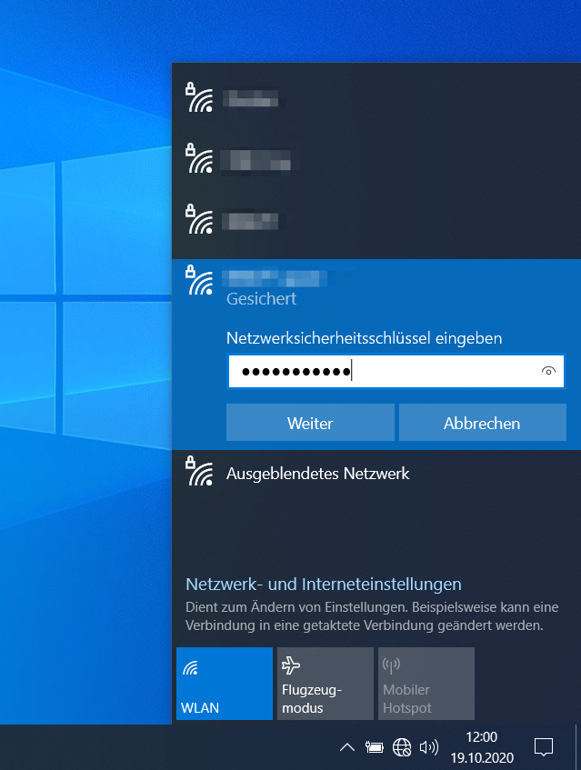

Wenn man mit dem WLAN verbunden ist, erscheint ein anderes Symbol unten in der Taskleiste. Über dieses Icon könnte man die Verbindung auch wieder trennen.
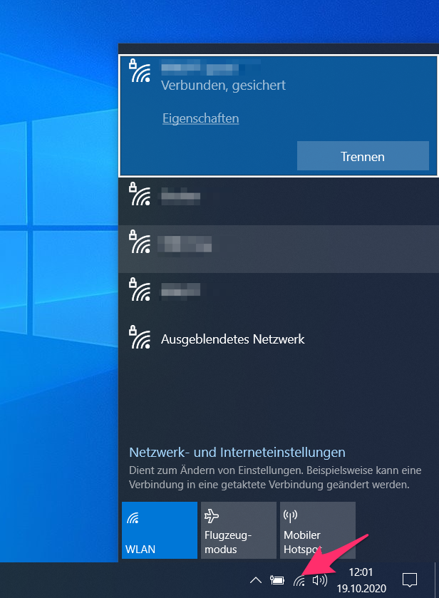

## Bekannte Probleme

Es folgt eine Beschreibung bekannter Probleme bei der Verwendung des HP-Notebooks.

### Ein App-Standardwert wurde zurückgesetzt

Beim ersten Einloggen erscheinen viele Meldungen rechts unten, dass Standardeinstellungen für manche Apps  zurückgesetzt wurden.

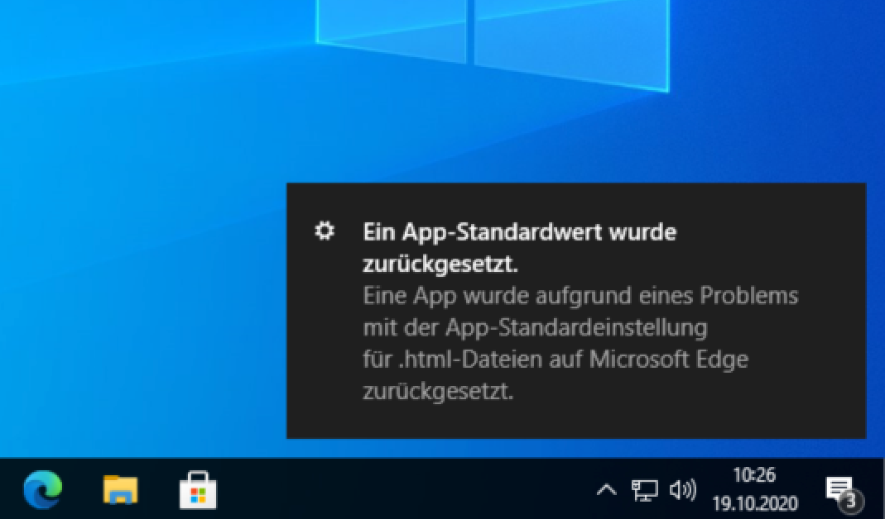

### Threat Prevention

Eim ersten Einloggen erscheint eine Meldung `Threat Prevention` für ein Microsoft Edge Update Setup.exe. Diese Meldung kann ignoriert werden.

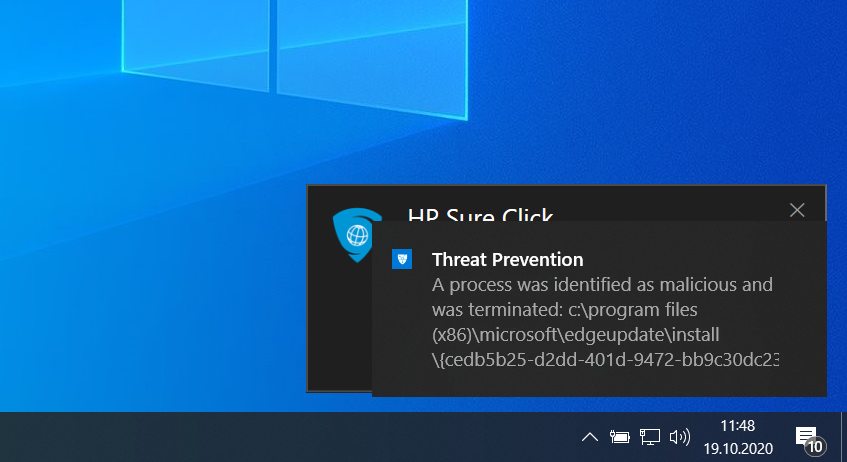