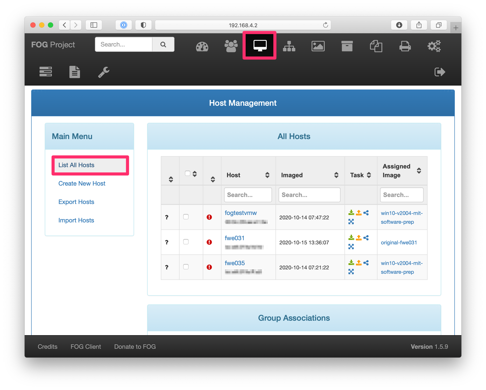

# FOG-Server an der FWE

Die aktuelle Version dieser Anleitung kann jederzeit unter folgender URL abgerufen werden:
- https://github.com/StefanScherer/fwe-fog/blob/main/README.md

## Ziele

Ziel dieses Projekts ist es, Leihnotebooks für Schüler*innen vorzubereiten.

- Erstellung eines Master-Images, das auf die Notebooks verteilt werden kann
- Zurücksetzen der Notebooks nach Rückgabe
- Aktualisierung des Master-Images mit neuen Windows-Updates oder neuer Software

## Aufbau

Im Normalbetrieb ist ein autarkes kleines Netzwerk vorgesehen. Dieses reicht aus, wenn nur die Notebooks zurückgesetzt werden müssen, bevor sie verliehen werden oder nach ihrer Rückgabe.


Ein Internetzugriff ist nur notwendig, wenn ein neues Image erstellt wird und etwa die Windows-Updates und die Software installiert werden sollen. Man kann zum Beispiel einen der Windows-Notebooks zuhause oder im WLAN vorbereiten und dann wieder per Kabel anschließen, um das Image in FOG einzuspielen.

Der FOG-Server dient auch als DHCP-Server, daher wird nur ein einfacher Switch und Patchkabel zwischen den Rechnern benötigt.

Die Anleitung ["Klonen von Windows mit dem FOG-Server"](https://schulnetz.alp.dillingen.de/materialien/Fog.pdf) der Akademie Dillingen - SCHULNETZ war beim Aufbau dieses Projektes sehr hilfreich, ebenso die weiteren [Materialien](https://schulnetz.alp.dillingen.de/materialien.html).

## FOG benutzen

Der FOG-Server (Linux-Notebook) speichert verschiedene Disk-Images und verwaltet die HP-Notebooks inklusive der Windows Produkt Keys.

Der FOG-Server bietet eine Web-Oberfläche, in der die Rechner und die Images verwaltet werden können.

Auf dem Linux-Notebook, oder von einem anderen Rechner im eigenen kleinen Netzwerk kann man im Browser folgende URL öffnen:
- http://192.168.4.2/fog/

Der Login erfolgt mit Benutzer `fog` und dem bekannten Passwort.

Im Dashbaord sieht man, wieviel Plattenplatz die Images insgesamt belegen.


Desweiteren gibt es noch zwei weitere Ansichten, mit denen hauptsächlich gearbeitet wird: Hosts und Images

Um alle Hosts zu sehen, oben zunächst auf das Symbol klicken und dann "List All Hosts" anklicken. Danach erscheint die Tabelle mit allen verwalteten Rechnern.



Sehr ähnlich findet man die Liste aller gespeicherten Images über das entsprechend andere Symbol und dann noch "List All Images" anklicken.


Im weiteren folgen nun typische Anwendungsfälle, die Schritt für Schritt erklärt werden.

### Einen neuen Rechner in die Liste aufnehmen

- FOG-Server per Patchkabel an den Switch anschließen
- FOG-Server hochfahren
- HP-Notebook per Patchkabel an den Switch anschließen
- HP-Notebook an die Stromversorgung anschließen
- Am HP-Notebook in das BIOS gehen. Hierzu den Rechner einschalten und immer wieder die F12 Taste drücken. Nach einigen Sekunden erscheint die Auswahl zum Netboot IPv4. Dieses mit der RETURN Taste bestätigen.
- Das Notebook bootet nun aus dem Netzwerk. Es erscheint ein Menü von FOG, das man sofort mit CURSOR DOWN anhalten sollte. Sonst bootet der Rechner nach 3 Sekunden automatisch wieder Windows.
- "Perform Full Host Registration and Inventory" auswählen
- Windows Product-Key gleich mit aufnehmen
- Es kann auch gleich ein Image ausgewählt und mit Deploy auf den Rechner gespielt werden, jedoch fehlen bei frischen Rechnern noch die BIOS-Einstellungen.
- Der Rechner ist nun in FOG registriert

### Ein Image auf ein Notebook aufspielen

Dies dürfte der häufigste Anwendungsfall sein. Ein HP-Notebook muss mit einem vorgefertigten Image bespielt werden, etwa weil der ausgeliehene Rechner zurückgegeben wurde.

- FOG-Server per Patchkabel an den Switch anschließen
- FOG-Server hochfahren
- HP-Notebook per Patchkabel an den Switch anschließen
- HP-Notebook an die Stromversorgung anschließen (Wake on LAN funktioniert nicht im Batteriebetrieb)
- HP-Notebook herunterfahren, falls es eingeschaltet sein sollte
- In FOG das Image dem Rechner zuweisen
  - In der Host-Liste den Rechner auswählen  
      
  - Eventuell das gewünschte Image auswählen, anschließend auf "Update" klicken
        
- Das HP-Notebook am einfachsten Herunterfahren, der FOG-Server weckt den Rechner automatisch auf und bootet ihn vom Netzwerk.
- In FOG beim Rechner den Task "Deploy" starten, das ist der **grüne Pfeil nach unten**. Nicht zu verwechseln mit dem orangefarbenen Pfeil, der sonst das Image am FOG-Server überschreiben würde.
  - Hierzu nochmal zurück in die Host-Liste gehen, um dann den Deploy-Task auswählen  
    
  - Nun den Task starten mit den vorausgewählten Optionen  
    
- Das HP-Notebook bootet nun automatisch vom Netzwerk und spielt das Disk-Image ein.
- Anschließend bootet das HP-Notebook automatisch in Windows. Hier erfolgt ein einmaliger automatischer Login als Benutzer `admin`, um die restliche Konfiguration durchzuführen. Danach startet der Rechner nochmal neu und es erscheint nur der Loginbildschirm.
  - Damit ist der Rechner nun fertig für den Verleih vorbereitet, beim ersten Login als Benutzer `Standard` muss ein neues Kennwort vergeben werden. Dies sollte dann von der Schülerin bzw. dem Schüler durchgeführt werden.
- Das HP-Notebook herunterfahren, ohne sich vorher als Benutzer `Standard` einzuloggen
- Das HP-Notebook vom Netzwerk trennen
- Den FOG-Server herunterfahren

### Ein Image vom Notebook sichern

Ganz zu Beginn wurden Disk-Images von einem HP-Notebook in FOG hochgeladen. Bei neuen Gerätetypen empfiehlt sich der gleiche Vorgang, um das Original-Image zu sichern.

- FOG-Server per Patchkabel an den Switch anschließen
- FOG-Server hochfahren
- HP-Notebook per Patchkabel an den Switch anschließen
- HP-Notebook an die Stromversorgung anschließen (Wake on LAN funktioniert nicht im Batteriebetrieb)
- HP-Notebook herunterfahren, falls es eingeschaltet sein sollte
- In FOG den Task "Capture" starten

### erstes Windows Image vorbereiten

- Den Rechner einschalten und alle Windows Updates einspielen.
- In den Audit Mode wechseln
  - `C:\Windows\system32\sysprep\sysprep.exe /audit /shutdown`
- Rechner wieder einschalten, ein Reboot beim vorherigen Befehl hat nicht funktioniert, daher der Shutdown und neuer Boot.
- Von diesem Stand ein Image in FOG erstellen, dann ist man bei der Software später noch flexibler.
- In FOG ein neues Image erzeugen, etwa `win10-v20h2-audit`
- Ins BIOS mit F12 zum Netboot
- "Perform Full Host Registration and Inventory" auswählen
- Windows Product-Key gleich mit aufnehmen
- Das neue Image dem Rechner zuweisen
- Rechner am einfachsten Herunterfahren, FOG weckt den Rechner automatisch auf.
- In FOG den Task "Capture" starten
- Ab jetzt hat man ein neues Image im Audit Mode, um immer wieder von hier aus Images mit der gewünschten Software zu bauen.

### Ein Image aktualisieren

- In FOG das Image `win10-v2004-audit` verwenden
- Wenn größere Windows Updates anstanden, möglichst wieder ein neues Image in FOG speichern, ansonsten weiter zur Installation der Software.
- Ein CMD Terminal im Adminmodus öffnen (WIN + R dann `cmd.exe`)
- Danach dann das Script zum Installieren der Software aufrufen
  ```
  curl.exe -o install.bat http://192.168.4.2/fwe-fog/install.bat
  install.bat
  ```
- Am Ende noch das Sysprep-Fenster nach vorne holen
  1. Out-of-Box-Experience (OOBE) für System aktivieren
  2. Verallgemeinern auswählen
  3. Option für Herunterfahren: Herunterfahren auswählen
  4. OK anklicken
- Der Rechner fährt herunter
- In FOG ein neues Image erzeugen, etwa `win10-v2004-mit-software-prep`
- Das neue Image dem Rechner zuweisen
- In FOG den Task "Capture" starten

## Vorbereitungen

Nun folgen die eher technischeren Details zum Aufbau und wie man den FOG-Server vorbereitet und installiert.
Ebenso finden sich hier noch Details, wie die HP-Notebooks vorbereitet werdne müssen (BIOS-Einstellungen), damit sie sich automatisieren lassen.

### FOG-Server vorbereiten

- Ein [FOG-Server](https://fogproject.org/) dient zur Ablage der Images und Verwaltung der Rechner
- Linux-Notebook mit Ubuntu und ausreichend Plattenplatz (500 GB)

- [statische IP Adresse am LAN-Port](https://www.howtoforge.com/linux-basics-set-a-static-ip-on-ubuntu)
  - [Beispielkonfiguration](server/etc/netplan/00-installer-config.yaml) mit `eno1` als Netzwerkkarte und IP-Adresse `192.168.4.2`
  - `sudo vi /etc/netplan/00-installer-config.yaml`
  - `sudo netplan apply`

- [DHCP-Server](https://www.techrepublic.com/article/how-to-setup-a-dhcp-server-with-ubuntu-server-18-04/) 
  - kann direkt über die FOG-Installation gemacht werden.
  - [Beispielkonfiguration](server/etc/dhcp/dhcpd.conf) mit DHCP-Bereich `192.168.4.10...254` und `192.168.4.2` als FOG-Server

- [FOG-Server installieren](https://schulnetz.alp.dillingen.de/materialien/Fog.pdf)
  - `sudo apt-get update`
  - `sudo apt-get upgrade`
  - `cd`
  - `git clone https://github.com/FOGProject/fogproject.git`
  - `cd ~/fogproject/bin`
  - Aktuelle Version von FOG auswählen
    `git checkout 1.5.9`
  - Installationsscript verwenden
    `sudo ./installfog.sh`
  - Es werden einige Dinge abgefragt, hier sind die Antworten
    * Here are the settings FOG will use:
    * Base Linux: Debian
    * Detected Linux Distribution: Ubuntu
    * Interface: eno1
    * Server IP Address: 192.168.4.2
    * Server Subnet Mask: 255.255.255.0
    * Server Hostname: fogserver
    * Installation Type: Normal Server
    * Internationalization: 0
    * Image Storage Location: /images
    * Using FOG DHCP: Yes
    * DHCP router Address: 192.168.4.1
  - URL http://192.168.4.2/fog öffnen und die Datenbank initialisieren

- Git Repo für die Automatisierung
  - Repo clonen
    `git clone git@github.com:StefanScherer/fwe-fog`
  - Repo ins Apache-Verzeichnis verschieben
    `sudo mv fwe-fog /var/www/html`
  - Repo aktualisieren
    `cd /var/www/html && git pull`
  - Windows-Passwörter anpassen
    `vi /var/www/html/fwe-fog/conf/unattend.xml`

### HP ProBook 455 G7 vorbereiten

- Schnellstart (Fast boot) abschalten
  - Systemsteuerung -> Hardware und Sound -> Energieoptionen
  - Verhalten des Netzschalters
  - Schnellstart deaktivieren
  - Siehe [`prepare/disable-fastboot.ps1`](prepare/disable-fastboot.ps1)
- BIOS mit F10
  - Secure Boot abschalten (Legacy boot enabled)
  - Wake on LAN aktivieren
  - Für HP-Notebooks siehe [`prepare/set-bios.ps1`](prepare/set-bios.ps1)
- Der Ordner `prepare` sollte auf einen USB-Stick kopiert werden, um dann bei jedem neuen HP Notebook das Script `D:\prepare.bat` aufzurufen. Dieses ruft dann die beiden PowerShell-Scripte auf und bereitet das BIOS und den Fastboot vor.

#### erster Boot

- Ermittlung einiger wichtiger Angaben jedes einzelnen Rechners
- PowerShell Terminal öffnen (WIN + R drücken, dann `powershell` eingeben und RETURN)
- Windows-Product-Key auslesen
  - `Get-CimInstance -Class SoftwareLicensingService`
  - unter `OA3xOriginalProductKey` steht der Key in der Form `XXXXX-XXXXX-XXXXX-XXXXX-XXXXX`
- MAC-Adressen auslesen
  - `Get-WmiObject win32_networkadapterconfiguration | select description, macaddress`
- Seriennummer auslesen
  - `wmic bios get serialnumber`

## Beschreibung der Automatisierung

Die gewünschten Softwarepakete und einige Einstellungen werden möglichst automatisch vorgenommen. Wie oben bereits gezeigt wurde, wird ein Script `install.bat` vom FOG-Server heruntergeladen, das dann noch weitere Scripte nachlädt.

In einem leeren Notebook, das gerade die aktuellen Windows Updates erhalten hat oder eines der `*-audit` Images zurückgespielt bekommen hat, wird das Script gestartet

Der bisherige Benutzer "admin" muss derzeit manuell entfernt werden.
- Eine CMD-Shell als Administrator öffnen.
   ```
   net user admin /DELETE
   ```
- Dann den Windows Explorer öffnen und das Verzeichnis C:\Users\admin komplett löschen.

Der Rechner befindet sich ja bereits im Audit Modus. Nun eine CMD Shell starten (WIN + R, dann `cmd` eingeben und RETURN).

```
curl.exe -o install.bat http://192.168.4.2/fwe-fog/install.bat
install.bat
```

### PowerShell Scripte erlauben

Das Script `install.bat` setzt erst einmal das Recht, weitere PowerShell-Scripte auszuführen.

### Install.ps1

Dann wird das Script `install.ps1` nachgeladen oder man kann es entsprechend direkt herunterladen und starten.

Dieses Script nimmt nun mehrere Änderungen vor, die in jeweils eigenen Scripten vermerkt sind:

- Fastboot deaktivieren in der Windows-Registry  
  Script [`scripts/disable-fastboot.ps1`](scripts/disable-fastboot.ps1)
- BIOS Einstellungen vornehmen. Hilft nur für den aktuellen Rechner und wird nicht ins Image übernommen.  
  Script [`scripts/set-bios.ps1`](scripts/set-bios.ps1)
- Installation des Chocolatey Paketmanagers  
  Script [`scripts/install-chocolatey.ps1`](scripts/install-chocolatey.ps1)
- Installation der gewünschten Software. Die Liste kann in diesem Script entsprechend erweitert oder verändert werden. Eine Suche auf [chocolatey.org](https://chocolatey.org) hilft, um den Paketnamen einer Software zu finden.  
  Script [`scripts/install-software.ps1`](scripts/install-software.ps1)
- Entfernen einiger Apps, die den Sysprep verhindern  
  Script [`scripts/remove-default-apps.ps1`](scripts/remove-default-apps.ps1)
- Entfernen des Windows Produktschlüssels  
  Script [`scripts/remove-productkey.ps1`](scripts/remove-productkey.ps1)
- Installation der automatischen Vorbereitung mit einem Admin-Account und einem Standard-Account. Die Namen der Accounts und die Passwörter können in der Datei [`conf/unattend.xml`](conf/unattend.xml) vorgenommen werden, lokal auf dem FOG-Server.  
  Script [`scripts/install-unattend.ps1`](scripts/install-unattend.ps1)
- Löschen einiger Cache-Verzeichnisse  
  Script [`scripts/cleanup.ps1`](scripts/cleanup.ps1)
- Aufruf von Sysprep  
  Script [`scripts/sysprep-generalize.ps1`](scripts/sysprep-generalize.ps1)
